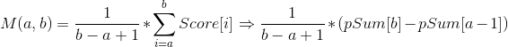
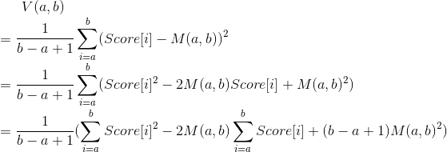

# 17장. 부분 합
## 17.1 도입
* Why?: *최적화*

* Idea:
  > 연속된 구간합을 구해서 그때그때마다 구간합을 구하면 O(N)의 시간 복잡도를 갖는다.
    score[a]부터 score[b]까지를 순회하며 각수를 더해야 하기 때문이다.
    하지만, 누적합(partialSum)을 이용하면 연속된 구간합(partialSum[b] - partialSum[a-1])을 O(1)만에 구할 수 있다.

  - Example 1: 배열 score[]의 각 원소와 해당 배열의 부분합
  
    i | 0 | 1 | 2 | 3 | 4 | 5 | 6 | 7 | 8 
    ---- | ---- | ---- | ---- | ---- | ---- | ---- | ---- | ---- | ----
    score | 100 | 97 | 86 | 79 | 66 | 52 | 49 | 42 | 31
    partialSum | 100 | 197 | 283 | 362 | 428 | 480 | 529 | 571 | 602
  
    - partialSum을 미리 계산해 두면 score[]의 특정 구간의 합을 O(1)에 구할 수 있음.
    - partialSum[b] - partialSum[a-1] (단, partialSum[-1] = 0)

* Code 17.1 부분합을 계산해주는 함수(partialSum)와 이를 이용해 구간합을 계산하는 함수
```c++
//주어진 벡터 a의 부분합을 계산
vector<int> partialSum(const vector<int>& a) {
  //1. partialSum vector 생성
  vector<int> ret(a.size());
  //2. 첫번째 Index 값 복사
  ret[0] = a[0];
  //3. 두번째 Index 부터 순회하여 Partial Sum 계산 
  for(int i = 1; i < a.size(); i++)
    ret[i] = ret[i-1] + a[i];
   
  //4. 계산한 Partial Sum Vector return
  return ret;
}

//어떤 벡터의 부분합 pSum[]이 주어질 때, 원래 벡터의 a부터 b까지의 합을 구한다.
int rangeSum(const vector<int>& pSum, int a, int b) {
  if(a == 0)  return psum[b];
  return pSum[b] - pSun[a-1];
}
```

* 응용 1: 임의의 a, b 연속된 구간 평균 구하기



* 응용 2: 임의의 a, b 연속된 구간 분산 구하기


* Code 17.2 제곱의 부분합을 계산해주는 함수(squarePartialSum)와 이를 이용해 특정 구간의 분산을 계산하는 함수
```c++
//주어진 벡터 a의 부분 제곱 합을 계산
vector<int> squarePartialSum(const vector<int>& a) {
  //1. partialSum vector 생성
  vector<int> ret(a.size());
  //2. 첫번째 Index 값 복사
  ret[0] = a[0] * a[0];
  //3. 두번째 Index 부터 순회하여 Sqaure Partial Sum 계산 
  for(int i = 1; i < a.size(); i++)
    ret[i] = ret[i-1] + a[i] * a[i];
   
  //4. 계산한 Partial Sum Vector return
  return ret;
}

//A[]의 제곱의 부분 합 벡터 sqpsum, A[]의 부분 합 벡터 psum이 주어질때
//A[a,b]의 분산을 반환한다 (sqpSum은 squarePartialSum()을 통해, psum은 partialSum을 통해 사전 계산한다.)
double variance(const vector<int>& sqpsum,
                const vector<int>& psum, int a, int b) {
  //1. 구간의 평균을 계산
  double mean = rangeSum(psum, a , b) / double(b - a + 1);
  double ret = rangeSum(sqpsum, a, b) - 2 * mean + rangeSum(psum, a, b);
}
```
