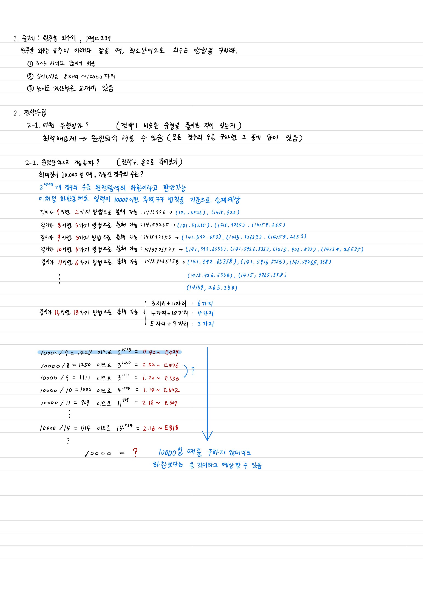
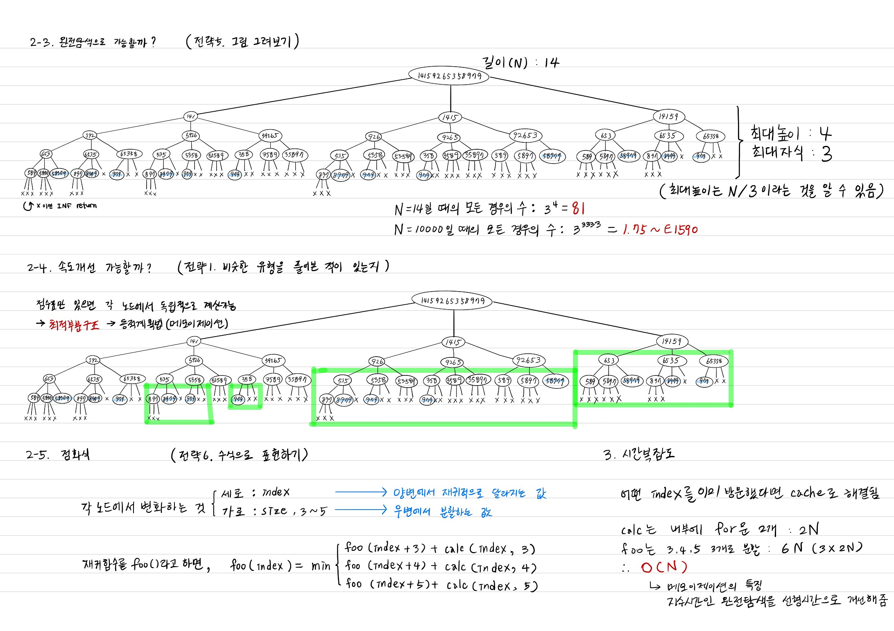
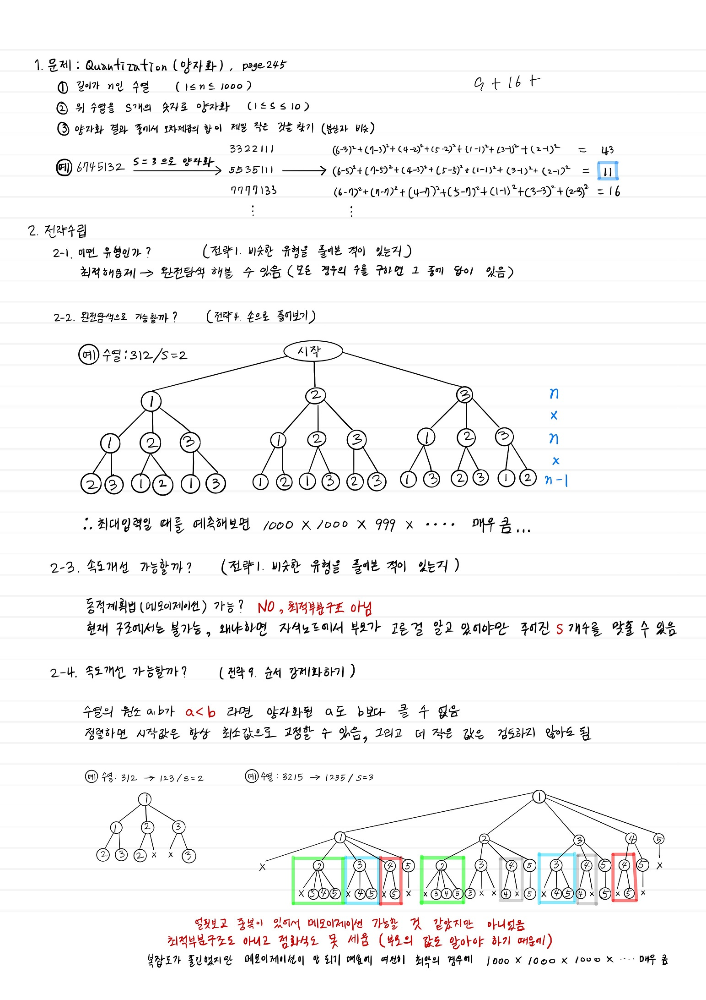
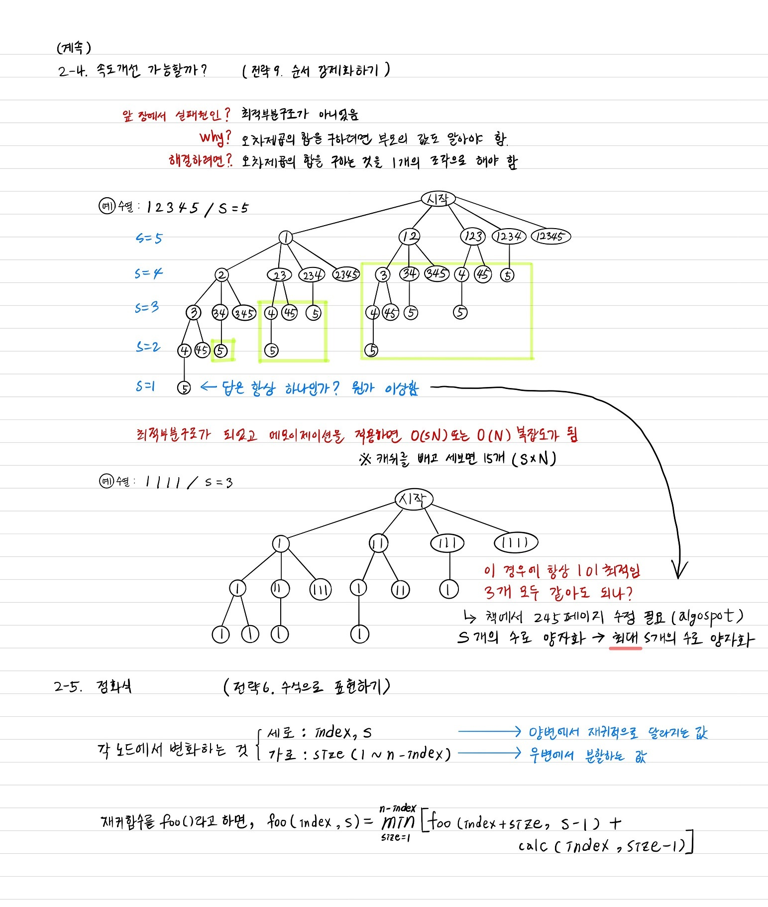
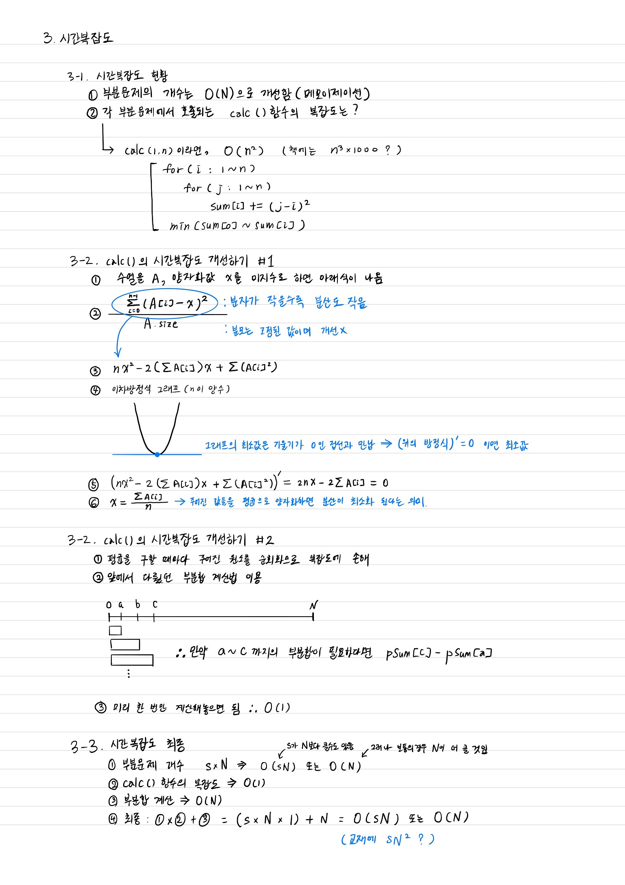
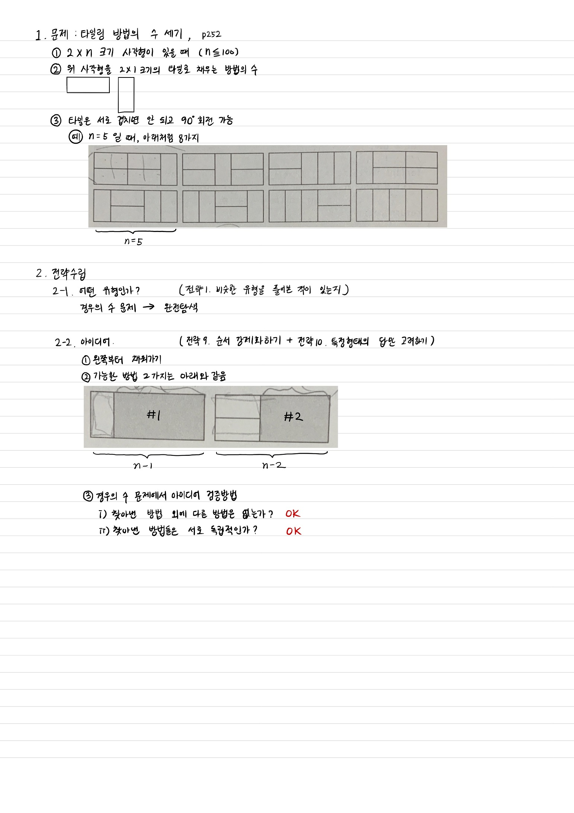
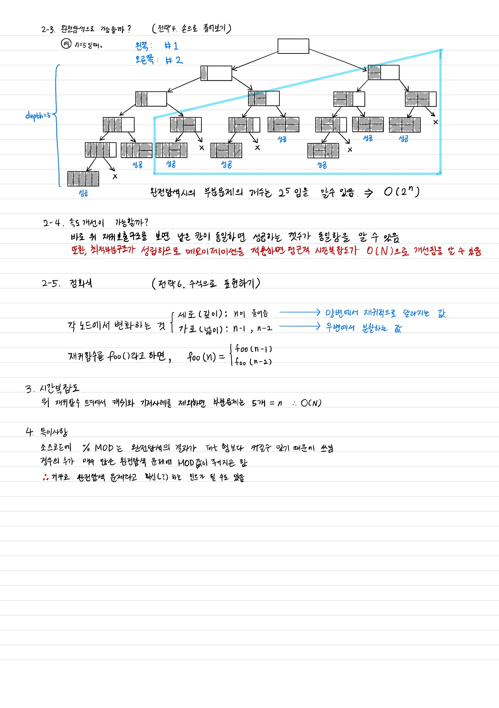
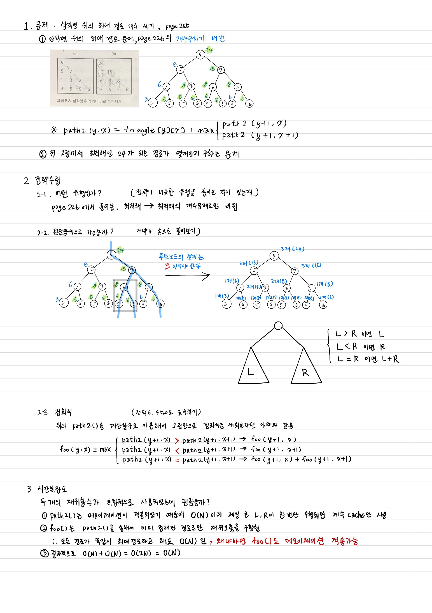

## 8.7~8.8 원주율 외우기 (문제 ID: PI, 난이도: 하)
### 해결과정
  
  
### 소스코드
  ```
  const int INF = 987654321;
  string N;
  
  int classify(int a, int b) {
    string M = N.substr(a, b-a+1);
    
    if(M == string(M.size(), M[0]))
      return 1;
    
    bool progressive = true;
    for(int i = 0; i < M.size(); ++i)
      if(M[i+1] - M[i] != M[i] - M[0])
        progressive = false;

    if(progressive && abs(M[1] - M[0]) == 1)
      return 2;

    bool alternating = true;
    for(int i = 0; i < M.size(); ++i)
      if(Mpi] != M[i%2])
        alternating = false;
    if(alternating) return 4;
    if(progressive) return 5;
    return 10;
  }
  
  int cache[10002];
  int memorize(int begin) {
    if(begin == N.size())
      return 0;
      
    int& ret = cache[begin];
    if(ret != -1)
      return ret;
    ret = INF;
    for(int L = 3; L <= 5; ++L)
      if(begin + L <= N.size())
        ret = min(ret, memorize(begin + L) + classify(begin, begin + L -1));
        
    return ret;
  }
  ```
## 8.9~8.19 Quantization (문제 ID: QUANTIZE, 난이도: 중)
### 해결과정
    
    
    
### 소스코드
  ```c++
  #include <iostream>
  #include <algorithm>

  using namespace::std;

  const int INF = 987654321;

  // A[] : 양자화해야 할 수열 (정렬된 상태)
  // pSum[] : A[] 의 부분합을 저장, pSum[i] = A[0] ~ A[i] 의 합
  // pSqSum[] : A[] 제곱의 부분합을 저장, pSqSum[i] = A[0]^2 ~ A[i]^2 의 합
  // 2개 모두, 최소값 공식에서 사용되기 때문에 미리 구해 놓는 것이다
  int n = 9;
  int A[9] = { 1, 744, 755, 4, 897, 902, 890, 6, 777 };
  int pSum[9], pSqSum[9];

  // A를 정렬라고 각 부분합을 미리 계산한다
  // 최초 1번만 미리 실행될 것이다, 재귀함수에서는 부르지 않는다
  void precalc() {
    sort(A, A + n);
    pSum[0] = A[0];
    pSqSum[0] = A[0] * A[0];

    for (int i = 1; i < n; ++i) {
      pSum[i] = pSum[i - 1] + A[i];
      pSqSum[i] = pSqSum[i - 1] + A[i] * A[i];
    }
  }

  // A[lo] ~ A[hi] 구간을 하나의 숫자로 표현할 때, 최소 오차합을 계산
  int minError(int lo, int hi)
  {
    // 부분합을 이용해 A[lo] ~ A[hi] 까지의 합을 구함
    // sum : 최소값을 구하려면 평균이 필요하기 때문에 sum도 필요하다
    // sqSum : 역시 위에서 증명한 공식을 계산하려면 필요하다
    int sum = pSum[hi] - (lo == 0 ? 0 : pSum[lo - 1]);
    int sqSum = pSqSum[hi] - (lo == 0 ? 0 : pSqSum[lo - 1]);

    // 평균 m 을 구한다 (반올림)
    int m = int(0.5 + (double)sum / (hi - lo + 1));

    // sum	(A[i] - m)^2 를 전개한 결과를 부분합으로 표현
    // m 을 이용한 오차제곱이 최소임을 우리는 이미 알고 있다
    int ret = sqSum - 2 * m * sum + m * m * (hi - lo + 1);
    return ret;
  }

  // 100은 수열의 최대 길이 = n, 11은 양자화 그룹의 최대개수 = s
  // O(ns)
  int cache[9][9];

  int quantize(int from, int parts) {
    // 기저사례
    if (from == n)
      return 0;

    // 기저사례 : 숫자는 아직 남았는데 더 묶을 수 없을 때 아주 큰 값을 반환한다
    if (parts == 0)
      return INF;

    int& ret = cache[from][parts];

    if (ret != -1)
      return ret;

    ret = INF;

    // 조각의 길이를 변화시켜 가며 최소치를 찾는다
    for (int partSize = 1; from + partSize <= n; ++partSize)
      ret = min(ret, minError(from, from + partSize - 1) + quantize(from + partSize, parts - 1));

    return ret;
  }

  int main() {

    precalc();
    memset(cache, -1, sizeof(int)*11*11);

    std::cout << quantize(0, 3) << std::endl;

    int a;
    cin >> a;
  }
  ```
## 8.11 경우의 수와 확률
### 예제: 타일링 방법의 수 세기 (문제 ID: TILING2, 난이도: 하)
### 해결과정
    
    
### 소스코드  
  ```
  const int MOD = 1000000007;
  int cache[101];
  
  int tiling(int width) {
    if(width <= 1) 
      return 1;
    
    int& ret = cache[width];
    if(ret != -1)
      return ret;
      
    return ret = (tiling(width-2) + tiling(width-1)) % MOD;
  }
  ```
### 예제: 삼각형 위의 최대 경로 개수 세기 (문제 ID: TRIPATHCNT, 난이도: 중)
### 해결과정
    
### 소스코드
  ```
  int countCache[100][100];
  
  int count(int y, int x) {
    if(y == n-1)
      return 1;
      
    int& ret = countCache[y][x];
    if(ret != -1)
      return ret;

    ret = 0;
    if(path2(y+1, x+1) >= path2(y+1, x))
      ret += count(y+1, x+1);

    if(path2(y+1, x+1) <= path2(y+1, x))
      ret += count(y+1, x);

    return ret;
  }
  ```
